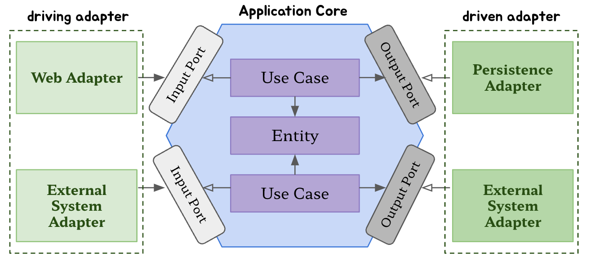

# 의존성 역전하기

## 단일 책임 원칙

* `하나의 컴포넌트는 오로지 한 가지 일만 해야하고, 그것을 올바르게 수행해야 한다`이는 좋은 조언이지만 단일 책임 원칙의 실제 의도는 아니다.
* 단일 책임 원칙의 실제 정의는 `컴포넌트를 변경하는 이유는 오직 하나뿐이어야 한다.`이다.
* 만약 컴포넌트를 변경할 이유가 한 가지라면 우리가 **어떤 다른 이유로** 소프트웨어를 변경하더라도 이 컴포넌트에 대해서는 전혀 신경 쓸 필요가 없다.
 소프트웨어가 변경되더라도 여전히 우리가 기대한 대로 동작할 것이기 때문이다.
* 안타깝게도 변경할 이유라는 것은 컴포넌트 간의 의존성을 통해 너무도 쉽게 전파된다. 많은 코드는 단일 책임 원칙을 위반하기 때문에 시간이 갈수록
 변경하기 더 어려워지고 그로 인해 변경 비용도 증가한다.
* 시간이 갈수록 컴포넌트를 변경할 더 많은 이유가 쌓여간다. 변경할 이유가 많이 쌓인 후에는 한 컴포넌트를 바꾸는 것이 다른 컴포넌트가 실패하는 원인으로 작용할 수 있다.

## 의존성 역전 원칙

* 계층형 아키텍처에서 계층 간 의존성은 항상 다음 계층인 아래 방향을 가리킨다. 단일 책임 원칙을 고수준에서 적용할 때 상위 계층들이 하위 계층들에 비해
 변경할 이유가 더 많다는 것을 알 수 있다.
* 그러므로 영속성 계층에 대한 도메인 계층의 의존성 때문에 영속성 계층을 변경할 때마다 잠재적으로 도메인 계층도 변경해야 한다.
* 이럴 경우 의존성을 역전 시켜 영속성 계층이 도메인 계층을 의존하도록 하면 된다.
* 도메인 계층에 영속성 계층의 엔티티와 리포티토리와 상호작용하는 서비스가 하나 있다. 엔티티는 도메인 객체를 표현하고 도메인 코드는 이 엔티티들의 상태를
 변경하는 일을 중심으로 하기 때문에 엔티티를 도메인 계층으로 올린다.
* 그러나 이제 영속성 계층의 리포지토리가 도메인 계층에 있는 엔티티에 의존하기 때문에 두 계층 사이에 순환 의존성이 생긴다.
 이 부분이 DIP를 적용하는 부분이다. 도메인 계층에 리포지토리에 대한 인터페이스를 만들고, 실제 리포지토리는 영속성 계층에서 구현하게 하는 것이다.

## 클린 아키텍처

* 로버트 마틴은 **클린 아키텍처**라는 용어를 같은 이름의 책에서 정립했다.
* 그는 클린 아키텍처에서 설계가 비즈니스 규칙의 테스트를 용이하게 하고, 비즈니스 규칙은 프레임워크, 데이터베이스, UI 기술, 그 밖의 외부 애플리케이션이나
 인터페이스로부터 독립적일 수 있다고 이야기 했다. 
* 이는 도메인 코드가 바깥으로 향하는 어떤 의존성도 없어야 함을 의미한다. 대신 의존성 역전 원칙의 도움으로 모든 의존성이 도메인 코드를 향하고 있다.
* 이 아케텍처에서 계층들은 동심원으로 둘러싸여 있다. 이 아키텍처에서 가장 주요한 규칙은 의존성 규칙으로 계층 간의 모든 의존성이 안쪽으로 향해야 한다는 것이다.
* 아키텍처의 코어에는 주변 유스케이스에서 접근하는 도메인 엔티티들이 있다. 유스케이스는 앞에서 서비스라고 불렸던 것들인데, 단일 책임을 갖기 위해 조금 더 세분화돼 있다.
* 이를 통해 이전에 이야기했던 넓은 서비스 문제를 피할 수 있다.
* 이 코어 주변으로 비즈니스 규칙을 지웒나느 애플리케이션의 다른 모든 컴포넌트들을 확인할 수 있다. 여기서 `지원`은 영속성을 제공하거나 UI를 제공하는 것 등을 의미한다.
* 또한 바깥쪽 계층들은 다른 서드파티 컴포넌트에 어댑터를 제공할 수 있다.
* 도메인 코드에서는 어떤 영속성 프레임워크나 UI 프레임워크가 사용되는지 알 수 없기 때문에 특정 프레임워크에 특화된 코드를 가질 수 없고 비즈니스 규칙에 집중할 수 있다.
* 하지만 클린아키텍처에는 대가가 따른다.
  * ORM 프레임워크를 사용한다면 도메인 계층은 영속성 계층을 모르기 때문에 도메인 계층에서 사용한 엔티티 클래스를 영속성 계층에서 함께
   사용할 수 없고 두 계층에서 각각 엔티티를 만들어야 한다.
  * 즉, 도메인 계층과 영속성 계층이 데이터를 주고받을 때, 두 엔티티를 서로 변환해야 한다. 이는 도메인 계층과 다른 계층들 사이에서도 마찬가지다.
  * 하지만 이것은 바람직한 일이다. 이것이 바로 도메인 코드를 프레임워크에 특화된 문제로부터 해방시키기고자 했던, 결합이 제거된 상태다.
  
## 육각형 아키텍처(헥사고날 아키텍처)
  

* `육각형 아키텍처`라는 용어는 알리스테어 콕번이 만든 용어로, 꽤 오랫동안 사용돼 왔다
* 육형 안에는 도메인 엔티티와 이와 상호작용하는 유스케이스가 있다. 육각형에서 외부로 향하는 의존성이 없고 대신 모든 의존성은 코어를 향한다.
* 육각형 바깥에는 애플리케이션과 상호작용하는 다양한 어댑터들이 있다. (웹, 데이터베이스, 외부 서비스 등등)
* 왼쪽 어댑터들은 (애플리케이션 코어를 호출하기 때문에) 애플리케이션을 주도하는 어댑터들이다. 반면 오른쪽에 있는 어댑터들은 (애플리케이션 코어에 의해
 호출되기 때문에) 애플리케이션에 의해 주도되는 어댑터들이다.
* 애플리케이션 코어와 어댑터들 간의 통신이 가능하려면 애플리케이션 코어가 각각의 포트를 제공해야 한다. 주도하는 어댑터에게는 그러한 포트가 코어에 있는
 유스케이스 클래스 중 하나에 의해 구현되고 어댑터에 의해 호출되는 인터페이스가 될 것이고, 주도되는 어댑터에게는 그러한 포트가 어댑터에 의해 구현되고 코어에 의해 호출되는 
 인터페이스가 될 것이다.
* 이러한 핵심 개념으로 인해 이 아키텍처 스타일은 **포트와 어댑터** 아키텍처로도 알려져 있다.

## 유지보수 가능한 소프트웨어를 만드는데 어떻게 도움이 될까?

* 의존성을 역전시켜 도메인 코드가 다른 바깥쪽 코드에 의존하지 않게 함으로써 영속성과 UI에 특화된 모든 문제로부터 도메인 로직의 결합을 제거하고
 코드를 변경할 이유의 수를 줄일 수 있다. 그리고 변경할 이유가 적을수록 유지보수성은 더 좋아진다.
* 도메인 코드는 비즈니스 문제에 딱 맞도록 자유롭게 모델링될 수 있고, 영속성 코드와 UI 코드도 영속성 문제와 UI 문제에 맞게 자유롭게 모델링될 수 있다.
