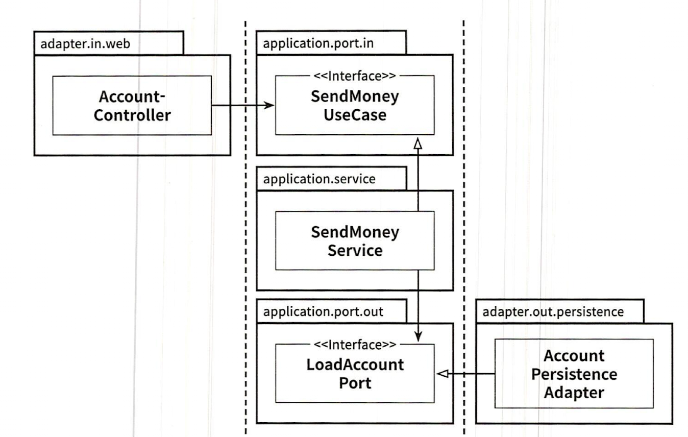

# 코드 구성하기

## 계층으로 구성하기

```bash
buckpal
|-- domain
|   |-- Account
|   |-- Activity
|   |-- AccountRepositoryy
|   |-- AccountService
|-- persistence
|   |-- AccountRepositoryImpl
|-- web
    |-- AccountController
```

* 웹 계층, 도메인 게층, 영속성 계층 각각에 대해 전용 패키지인 web, domain, persistence 를 작성했다.
* 세 가지 이유로 이 패키지 구조는 최적의 구조가 아니다.
  1. 애플리케이션의 기능 조각(functional slice)이나 특성(feature)을 구분 짓는 패키지 경계가 없다.
     * 이 구조에서 사용자를 관리하는 기능을 추가해야 한다면 `web` 패키지에 `UserController`를 추가하고, `domain` 패키지에 
   `UserService, UserRepository, User`를 추가하고 `persistence`패키지에 `UserRepositoryImpl`을 추가하게 될 것이다.
   추가적인 구조가 없다면, 아주 빠르게 서로 연관되지 않은 기능들끼리 예상하지 못한 부수효과를 일으킬 수 있는 클래스들의 엉망진창 묶음으로 변모할 가능성이 크다.
  2. 애플리케이션이 어떤 유스케이스들을 제공하는지 파악할 수 없다.
     * 특정 기능을 찾기 위해서는 어떤 서비스가 이를 구현했는지 추측해야 하고, 해당 서비스내의 어떤 메서드가 그에 대한 책임을 수행하는지 찾아야 한다.
  3. 패키지 구로를 통해서는 우리가 목표로 하는 아키텍처를 파악할 수 없다.
     * 육각형 아키텍처 스타일을 따랐다고 추측할 수는 있고, 그렇기 때문에 웹 어댑터와 영속성 어댑터를 찾기 위해 `web, persistence` 패키지의 클래스들을
      조사해볼 수 있다.
     * 하지만 어떤 기능이 웹 어댑터에서 호출되는지, 영속성 어댑터가 도메인 계층에 어떤 기능을 제공하는지 한눈에 알아볼 수 없다.

## 기능으로 구성하기

```bash
buckpal
|-- account
    |-- Account
    |-- AccountController
    |-- AccountRepository
    |-- AccountRepositoryImpl
    |-- SendMoneyService
```

* 모든 코드를 최상위의 `account` 패키지에 넣었다. 계층 패키지도 없앴다.
* 각 기능을 묶은 새로운 그룹은 `account`와 같은 레벨의 새로운 패키지로 들어가고 패키지 외부에서 접근되면 안된는 클래스들에 대해 `package-private` 접근 수준을
 이용해 패키지 간의 경계를 강화할 수 있다.
* 패키지 경계를 `package-private` 접근 수준과 결합하면 각 기능 사이의 불필요한 의존성을 방지할 수 있다.
* 또한 `AccountService`의 책임을 좁히기 위해 `SendMoneyService`로 변경하였다. 애플리케이션의 기능을 코드를 통해 볼 수 있게 만드는 것을
 가르켜 로버트 마틴이 `소리치는 아키텍처`라고 명명한 바 있다.
* 그러나 기능에 의한 패키징 방식은 사실 계층에 의한 패키징 방식보다 아키텍처의 **가시성을 휠씬 더 떨어뜨린다.**
* `package-private` 접근 수준을 이용해 도메인 코드가 실수로 영속성 코드에 의존하는 것을 막을 수 없다.

## 아키텍처적으로 표현력 있는 패키지 구조

```bash
buckpal
|-- account
    |-- adapter
    |   |-- in
    |   |   |-- web
    |   |       |-- AccountController
    |   |-- out
    |   |   |-- persistence
    |   |       |-- AccountPersistenceAdapter
    |   |       |-- SpringDataAccountRepository
    |-- domain
    |   |-- Account
    |   |-- Activity
    |-- application
        |-- SendMoneyService
        |-- port
            |-- in
            |   |-- SendMoneyUseCase
            |-- out
            |   |-- LoadAccountPort
            |   |-- UpdateAccountStatePort
```

* 최상위에는 `Account`와 관련된 유스케이스를 구현한 모듈임을 나타내는 `account` 패키지가 있다.
* 그 다음 레벨에는 도메인 모델이 속한 `domain` 패키지가 있다.
* `application` 패키지는 도메인 모델을 둘러싼 서비스 계층을 포함한다.
  * `SendMoneyService`는 인커밍 포트 인터페이스인 `SendMoneyUseCase`를 구현하고, 
  * 아웃고잉 포트 인터페이스이자 영속성 어댑터에 의해 구현된 `LoadAccountPort, UpdateAccountStatePort`를 사용한다.
* `adapter` 패키지는 애플리케이션 계층의 인커밍 포트를 호출하는 인커밍 어댑터와 애플리케이션 계층의 아웃고잉 포트에 대한 구현을 제공하는 아웃고잉 어댑터를 포함한다.

### 패키지가 아주 많다는 것은 모든 것을 public 으로 만들어서 패키지 간의 접근을 허용해야 하는 것을 의미하는 걸까?

* 어댑터 패키지에 대해서는 그렇지 않다. 이 패키지에 들어 있는 모든 클래스들은 `application` 패키지 내에 있는 포트 인터페이스를 통하지 않고는
 바깥에서 호출되지 않기 때문에 `package-private` 접근 수준으로 둬도 된다. 그러므로 애플리케이션 계층에서 어댑터 클래스로 향하는 우발적인 의존성은 있을 수 없다.
* 하지만 `application` 패키지와 `domain` 패키지 내의 일부 클래스들은 `public`으로 지정해야 한다.
  * 의도적으로 어댑터에서 접근 가능해야 하는 포트들은 `public`이어야 한다.
  * 서비스는 인커밍 포트 인터페이스 뒤에 숨겨질 수 있기 때문에 `public`일 필요가 없다.

## 의존성 주입의 역할

* 클린 아키텍처의 가장 본질적인 요건은 애플리케이션이 인커밍/아웃고잉 어댑터에 의존성을 갖지 않는 것이다.
* 영속성 어댑터와 같이 아웃고잉 어댑터에 대해서는 제어 흐름의 반대 방향으로 의존성을 돌리기 위해 의존성 역전 원칙을 이용해야 한다.
  * 애플리케이션 계층에 인터페이스를 만들고 어댑터에 해당 인터페이스를 구현한 클래스를 두면 된다.
  * 육각형 아키텍처에서는 이 인터페이스가 포트다. 애플리케이션 계층은 어댑터의 기능을 싱해아힉 위해 이 포트 인터페이스를 호출한다.
* 모든 계층에 의존성을 가진 중립적인 컴포넌트를 하나 도입하는 것이다. 이 컴포넌트는 아키텍처를 구성하는 대부분의 클래스를 초기화하는 역할을 한다.
  * 
