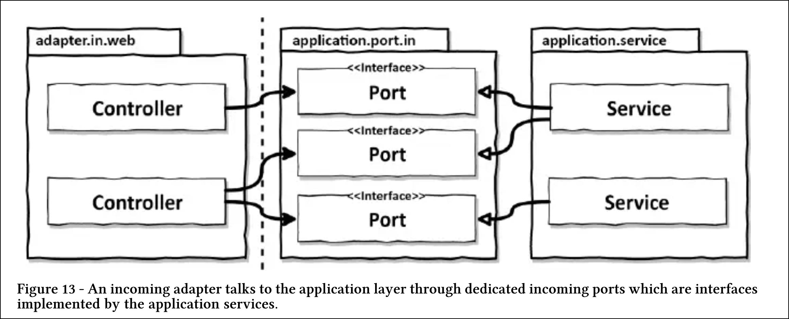
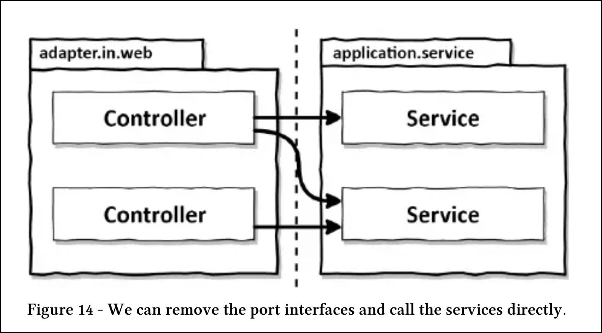

# 웹 어댑터 구현하기

## 의존성 역전

* 웹 어댑터는 인커밍 어댑터다. 외부로부터 요청을 받아 애플리케이션 코어를 호출하고 무슨 일을 해야 할지 알려준다.
* 제어 흐름은 웹 어댑터에 있는 컨트롤러에서 애플리케이션 계층에 있는 서비스로 흐른다.
* 애플리케이션 계층은 웹 어댑터가 통신할 수 있는 특정 포트를 제공한다. 서비스는 포트를 구현하고, 웹 어댑터는 이 포트를 호출할 수 있다.
* **의존성 역전 원칙**이 적용된 것을 볼 수 있다.

* 제어의 흐름이 왼쪽에서 오른쪽으로 흐르기 때문에 웹 어댑터가 유스케이스를 직접 호출할 수 있다.
* 하지만 유스케이스 사이에 또 다른 계층을 넣는 이유는 무엇일까?
* 애플리케이션 코어가 외부 세계와 통신할 수 있는 곳에 대한 명세가 포트이기 때문이다.
* 포트를 적절한 곳에 위치시키면 외부와 어떤 통신이 일어나고 있는지 정확히 알 수 있다.

### 포트가 무조건 필요한 경우

* 웹 소켓을 통해 실시간 데이터를 브라우저로 보낸다고 가정해보자.
* 이러한 경우 웹 어댑터는 인커밍 어댑터인 동시에 아웃고잉 어댑터가 된다.
* 하지만 한 어댑터가 동시에 두 가지 역할을 하지 못할 이유는 없다.

## 웹 어댑터의 책임

* 웹 어댑터는 URL, 경로, HTTP 메서드, 콘텐츠 타입과 같이 특정 기준을 만족하는 HTTP 요청을 수신해야 한다.

1. HTTP 요청을 자바 객체로 매핑
2. 권한 검사
3. 입력 유효성 검증
4. 입력을 유스케이스의 입력 모델로 매핑
5. 유스케이스 호출
6. 유스케이스의 출력을 HTTP로 매핑
7. HTTP 응답을 반환

* 웹 어댑터의 입력 모델을 유스케이스의 입력 모델로 변환할 수 있다는 것을 검증해야 한다.
* 이 책임들은 애플리케이션 계층이 신경 쓰면 안 되는 것들이기도 하다. HTTP와 관련된 것은 애플리케이션 계층으로
 침투해서는 안 된다.

## 컨트롤러 나누기

* 웹 어댑터는 한 개 이상의 클래스로 구성해도 된다. 하지만 클래스들이 같은 소속이라는 것을 표현하기 위해 같은 패키지 수준에 놓아야 한다.
* 컨트롤러는 너무 적은 것보다는 너무 많은 게 낫다.
* 가급적 메서드와 클래스명은 유스케이스를 최대한 반영해서 지어야한다.
* 이러한 전용 모델 클래스들은 컨트롤러의 패키지에 대해 `private`으로 선언할 수 있기 때문에 실수로 다른 곳에서 재사용될 일이 없다.
* 이렇게 나누는 스타일의 또 다른 장점은 서로 다른 연산에 대한 동시 작업이 쉬워진다는 것이다.
