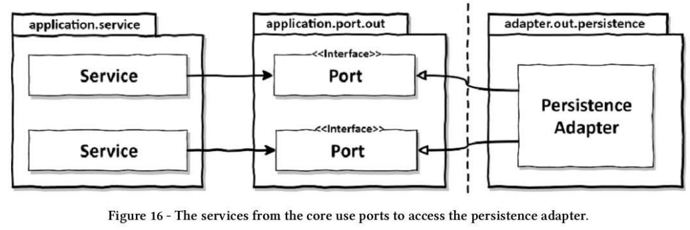
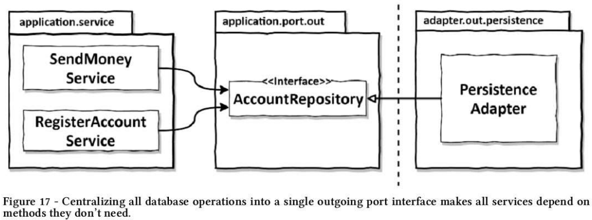
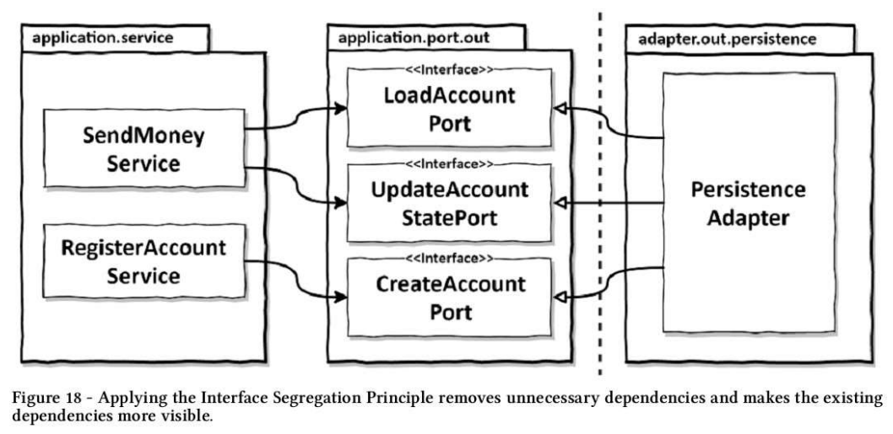
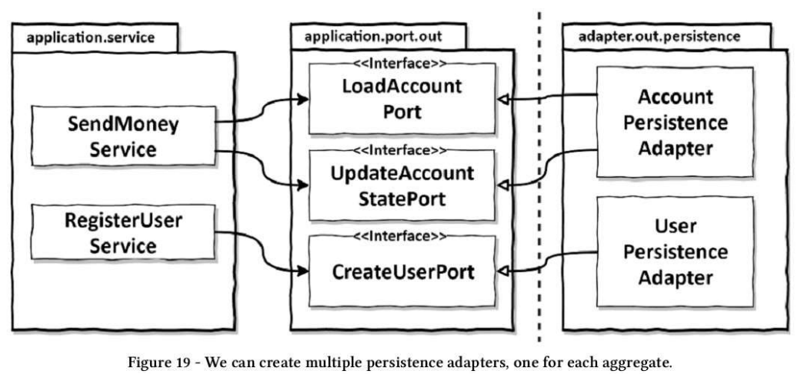

# 영속성 어댑터 구현하기

## 의존성 역전

* 애플리케이션 서비스에서는 영속성 기능을 사용하기 위해 포트 인터페이스를 호출한다.
* 이 포트는 실제로 영속성 작업을 수행하고 데이터베이스와 통신할 책임을 가진 영속성 어댑터 클래스에 의해 구현된다.
* 영속성 어댑터는 아웃고잉 어댑터로 애플리케이션에 의해 호출될 뿐, 애플리케이션을 호출하지는 않느다.
* 자연스럽게 런타임에도 의존성은 애플리케이션 코어에서 영속성 어댑터로 향한다.

## 영속성 어댑터의 책임

1. 입력을 받는다.
   * 포트 인터페이스를 통해 입력 받는다.
2. 입력을 데이터베이스 포맷으로 매핑한다.
3. 입력을 데이터베이스로 보낸다.
4. 데이터베이스 출력을 애플리케이션 포맷으로 매핑한다.
5. 출력을 반환한다.
   * 출력 모델이 영속성 어댑터가 아니라 애플리케이션 코어에 위치하는 것이 중요하다.

## 포트 인터페이스 나누기

* 서비스를 구현하면서 생기는 의문은 데이터베이스 연산을 정의하고 있는 포트 인터페이스를 어떻게 나눌 것인가다.

* 하나의 아웃고잉 포트 인터페이스에 모든 데이터베이스 연산을 모아두면 모든 서비스가 실제로는 필요하지 않은 메서드에 의존하게 된다.
* 인터페이스 분리 원칙(ISP)을 이용해 해결할 수 있다.

* 인터페이스 분리 원칙을 적용하여 불필요한 의존성을 제거하고 기존 의존성을 눈에 더 잘 띄게 만들 수 있다.
* 물론 모든 상황에 `포트 하나당 하나의 메서드`를 적용하지는 못할 것이다. 응집성이 높고 함께 사용될 때가 많기 때문에 하나의 인터페이스에
 묶고 싶은 데이터베이스 연산들이 있을 수 있다.

## 영속성 어댑터 나누기

* 모든 영속성 포트를 구현하는 한, 하나 이상의 클래스 생성을 금지하는 규칙은 없다.

* 이렇게 하면 영속성 어댑터들은 각 영속성 기능을 이용하는 도메인 경계를 따라 자동으로 나눠진다.
* 영속성 어댑터를 휠씬 더 많은 클래스로 나눌 수도 있다. 
  * JPA나 매퍼를 이용한 영속성 포트도 구현하면서 성능을 개선하기 위해 평범한 SQL을 이용하는 다른 종류의 포트도 함께 구현 가능
  * 그 후에 JPA 어댑터 하나와 평이한 SQL 어댑터 하나를 만들고 각각이 영속성 포트의 일부분을 구현하면 된다.
* 도메인 코드는 영속성 포트에 의해 정의된 명세를 어떤 클래스가 충족시키는지에 관심이 없다는 사실을 기억하자.
* 모든 포트가 구현돼 있기만 한다면 영속성 계층에서 하고 싶은 어떤 작업이든 해도 된다.

## 트랜잭션은 어떻게 해야 할까?

* 트랜잭션은 하나의 특정한 유스케이스에 대해서 일어나는 모든 쓰기 작업에 걸쳐 있어야 한다. 그래야 그중 하나라도 실패할 경우 다 같이 롤백될
 수 있기 때문이다.
* 영속성 어댑터는 어떤 데이터베이스 연산이 같은 유스케이스에 포함되는지 알지 못하기 때문에 언제 트랜잭션을 열고 닫을지 결정할 수 없다.
* 이 책임은 영속성 어댑터 호출을 관장하는 서비스에 위임해야 한다.
* 자바와 스프링은 `@Transactional` 애너테이션을 이용해 트랜잭션으로 감싼다.
