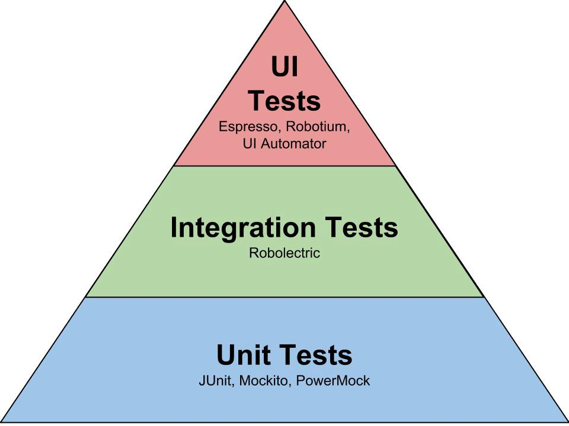

# 아키텍처 요소 테스트하기

## 테스트 피라미드

* 기본 전제는 만드는 비용이 적고, 유지보수하기 쉽고, 빨리 실행되고, 안정적인 작은 크기의 테스드들에 대해 높은 커버리지를 유지해야 한다는 것이다.
* 이 테스트는 하나의 `단위(일반적으로 하나의 클래스)`가 제대로 동작하는지 확인할 수 있는 단위 테스트들이다.
* 여러 개의 단위와 단위를 넘는 경계, 아키텍처 경계, 시스템 경계를 결합하는 테스트는 만드는 비용이 더 비싸지고, 실행이 더 느려지며 (기능 에러가
 아닌 설정 에러로 인해) 깨지기 더 쉬워진다.
* 테스트 피라미드는 테스트가 비싸질수록 테스트의 커버리지 목표는 낮게 잡아야 한다는 것을 보여준다. 그렇지 않으면 새로운 기능을 만드는 것보다 테스트를
 만드는 데 시간을 더 쓰게 되기 때문이다.

### 단위 테스트

* 피라미드의 토대에 해당한다. 일반적으로 하나의 클래스를 인스턴스화하고 해당 클래스의 인터페이스를 통해 기능들을 테스트한다.
* 만약 테스트 중인 클래스가 다른 클래스에 의존한다면 의존되는 클래스들은 인스턴스화하지 않고 테스트하는 동안 필요한 작업들을 흉내 내는 목(mock)으로 대체한다.

### 통합 테스트

* 연결된 여러 유닛을 인스턴스화하고 시작점이 되는 클래스의 인스턴스로 데이터를 보낸 후 유닛들의 네트워크가 기대한대로 잘 동작하는지 검증한다.

### 시스템 테스트

* 애플리케이션을 구성하는 모든 객체 네트워크를 가동시켜 특정 유스케이스가 전 계층에서 잘 동작하는지 검증한다.

## 단위 테스트로 도메인 엔티티 테스트

* 단위 테스트가 도메인 엔티티에 녹아 있는 비즈니스 규칙을 검증하기에 가장 적절한 방법이다.
* 도메인 엔티티의 행동은 다른 클래스에 거의 의존하지 않기 때문에 다른 종류의 테스트는 필요하지 않다.

## 단위 테스트로 유스케이스 테스트

* 테스트에서 어떤 상호작용을 검증하고 싶은지 신중하게 생각해야 한다. 모든 동작을 검증하는 대신 중요한 핵심만 골라 집중해서 테스트하는 것이 좋다.
* 만약 모든 동ㅈ가을 검증하려고 하면 클래스가 조금이라도 바뀔 때마다 테스트를 변경해야 한다.
* 이 테스트는 단위 테스트이긴 하지만 의존성의 상호작용을 테스트하고 있기 때문에 통합 테스트에 가깝다. 그렇지만 목으로 작업하고 있고
 실제 의존성을 관리해야 하는 것은 아니기 때문에 완전한 통합 테스트에 비해 만들고 유지보수하기 쉽다.

## 통합 테스트로 웹 어댑터 테스트

* 웹 어댑터는 JSON 문자열 등의 형태로 HTTP를 통해 입력을 받고, 입력에 대한 유효성 검증을 하고, 유스케이스에서 사용할 수 있는 포맷으로 매핑하고,
 유스케이스에 전달한다. 그러고 나서 다시 유스케이스의 결과를 JSON으로 매핑하고 HTTP 응답을 통해 클라이언트에 반환한다.
* `@WebMvcTest` 애너테이션을 이용해 통합 테스트를 진행할 수 있다. `@WebMvcTest` 애너테이션은 스프링이 특정 요청 경로, 자바와 JSON 간의 매핑,
HTTP 입력 검증 등에 필요한 전체 객체 네트워크를 인스턴스화하도록 만든다. 그리고 테스트에서는 웹 컨트롤러가 이 네트워크의 일부로서 잘 동작하는지 검증한다.
* 웹 컨트롤러가 스프링 프레임워크에 강하게 묶여 있기 때문에 격리된 상태로 테스트하기보다는 이 프레임워크와 통합된 상태로 테스트하는 것이 합리적이다.
* 웹 컨트롤러를 평범한 단위 테스트로 테스트하면 모든 매핑, 유효성 검증, HTTP 항목에 대한 커버리지가 낮아지고, 프레임워크를 구성하는 이런 요소들이
 프로덕션 환경에서 정상적으로 작동할지 확신할 수 없게 된다.

## 통합 테스트로 영속성 어댑터 테스트

* 비슷한 이유로 영속성 어댑터의 테스트에는 단위 테스트보다는 통합 테스트를 적용하는 것이 합리적이다.
* 단순히 어댑터의 로직만 검증하고 싶은 게 아니라 데이터베이스 매핑도 검증하고 싶기 때문이다.
* `@DataJpaTest` 애너테이션으로 스프링 데이터 리포지토리들을 포함해서 데이터베이스 접근에 필요한 객체 네트워크를 인스턴스화해야 한다고 스프링에 알려준다.
* `@Import` 애너테이션을 추가해서 특정 객체가 이 네트워크에 추가됐다는 것을 명확하게 표현할 수 있다.
* 이 테스트는 데이터베이스를 모킹하지 않았다는 점이 중요하다. 테스트가 실제로 데이터베이스에 접근한다. 데이터베이스를 모킹했더라도
 테스트는 여전히 같은 코드 라인수만큼 똑같이 높은 커버리지를 보여줬을 것이다. 하지만 높은 커버리지도 불구하고 여전히 실제 데이터베이스와 연동했을 때
 SQL 구문의 오류나 데이터베이스 테이블과 자바 객체 간의 매핑에러 등으로 문제가 생길 확률이 높아진다.
* 스프링에서는 기본적으로 인메모리 데이터베이스를 사용하는데 실용적이기는 하지만 프로덕션 환경에서는 인메모리 db를 사용하지 않는 경우가 많다.
* 데이터베이스 고유 sql 문법이 있기 때문에 영속성 어댑터 테스트는 실제 데이터베이스를 대상으로 진행해야 한다.
* `Testcontainers` 같은 라이브러리를 필요한 데이터베이스를 도커 컨테이너에 띄울 수 있기 때문에 이런 측명에서 아주 유용하다.

## 시스템 테스트로 주요 경로 테스트

* 전체 애플리케이션을 띄우고 API를 통해 요청을 보내고, 모든 계층이 조화롭게 잘 동작하는지 검증한다.
* `@SpringBootTest` 애너테이션은 스프링이 애플리케이션을 구성하는 모든 객체 네트워크를 띄우게 한다.
* 웹 어댑터처럼 `MockMvc`를 이용해 요청을 보내는 것이 아니라 `TestRestTemplate`을 이용해 요청을 보낸다.
  * 테스트를 프로덕션 환경에 조금 더 가깝게 만들기 위해 실제 HTTP 통신을 하는 것이다.
* 시스템 테스트라고 하더라도 언제나 서드파티 시스템을 실행해서 테스트할 수 있는 것은 아니기 때문에 결국 모킹을 해야 할 때도 있다.
* 육각형 아키텍처는 이러한 경우 몇 개의 출력 포트 인터페이스만 모킹하면 되기 때문에 아주 쉽게 이 문제를 해결할 수 있다.
* 시스템 테스트는 단위 테스트와 통합 테스트가 발견하는 버그와는 또 다른 종류의 버그를 발견해서 수정할 수 있게 해준다.
  * ex) 단위, 통합 테스트만으로는 알아차리지 못했을 계층 간 매핑 버그 등등

## 얼마만큼의 테스트가 충분할까?

* 라인 커버리지는 테스트 성공을 측정하는 데 있어서는 잘못된 지표다.
  * 코드의 중요한 부분이 전혀 커버되지 않을 수 있기 때문에 100%를 제외한 어떤 목표도 완전히 무의미하다.
  * 심지어 100%라 하더라도 버그가 잘 잡혔는지 확신할 수 없다.
* 테스트를 실행한 후 소프트웨어를 배포해도 될 만큼 테스트를 신뢰한다면 그것으로 된 것이다.
  * 더 자주 배포할수록 테스트를 더 신뢰할 수 있다.
* 육각형 아키텍처에서 사용하는 테스트 정의하는 전략

1. 도메인 엔티티를 구현할 때는 단위 테스트로 커버하자
2. 유스케이스를 구현할 때는 단위 테스트로 커버하자
3. 어댑터를 구현할 때는 통합 테스트로 커버하자
4. 사용자가 취할 수 있는 중요 애플리케이션 경로는 시스템 테스트로 커버하자

* 리팩터링할 때마다 테스트 코드도 변경해야 한다면 테스트는 테스트로서의 가치를 잃는다.
