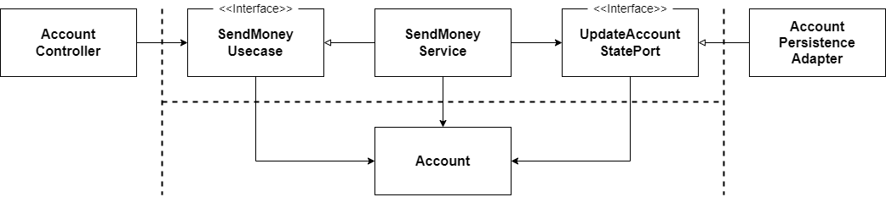
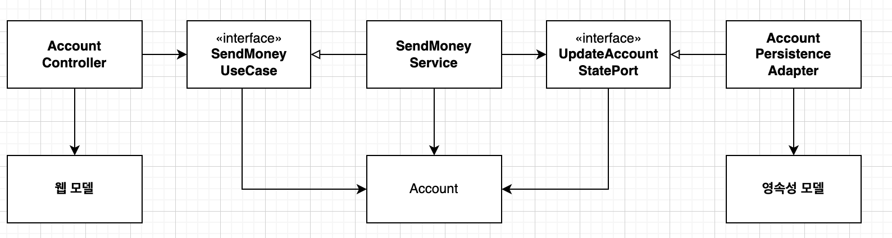
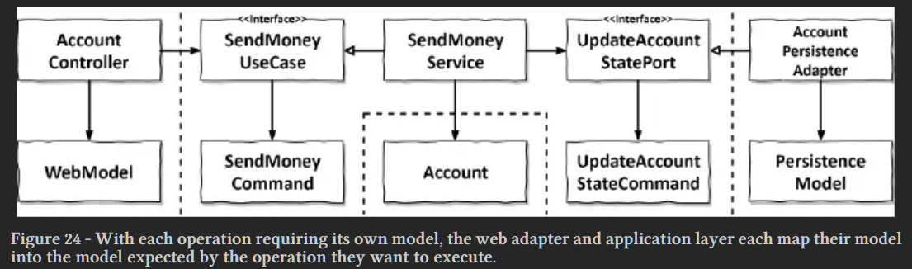
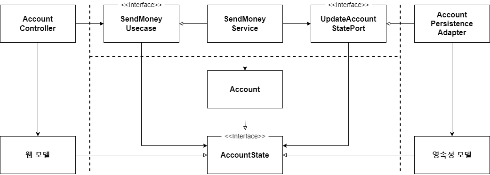

# 경계 간 매핑하기

* 매핑을 찬성하는 개발자
  * 두 계층 간에 매핑을 하지 않으면 양 계층에서 같은 모델을 사용해야 하는데 이렇게 하면 두 계층이 강하게 결합됩니다.
* 매핑을 반대하는 개발자
  * 하지만 두 계층 간에 매핑을 하게 되면 보일러플레이트 코드를 너무 많이 만들게 돼요.
  * 많은 유스케이스들이 오직 CRUD만 수행하고 계층에 걸쳐 같은 모델을 사용하기 때문에 계층 사이의 매핑은 과합니다.

## 매핑하지 않기 전략

* 포트 인터페이스가 도메인 모델을 입출력 모델로 사용하면 두 계층 간의 매핑을 할 필요가 없다.
* 웹 계층과 영속성 계층은 모델에 대해 특별한 요구사항이 있을 수 있다. 이러한 경우 각 계층에 대한 특정 애너테이션이 필요해진다.
* 도메인과 애플리케이션 계층은 웹이나 영속성과 관련된 특수한 요구사항에 관심이 없음에도 불구하고 도메인 모델 클래스는 이런 모든 요구사항을 다뤄야 한다.
* 도메인 모델 클래스는 웹, 애플리케이션, 영속성 계층과 관련된 이유로 인해 변경돼야 하기 때문에 **단일 책임 원칙**을 위반한다.
* 기술적 요구사항이 아니더라도, 각 계층이 도메인 모델 클래스에 특정 커스텀 필드를 두도록 요구할 수 있다. 그 결과, 오로지 한 계층에서만 필요한 필드들을
 포함하는 파편화된 도메인 모델로 이어질 수 있다.
* `매핑하지 않기` 전략은 모든 계층이 정확히 같은 구조의, 정확히 같은 정보를 필요로 한다면 `매핑하지 않기` 전략은 완벽한 선택지다.

## 양뱡향 매핑 전략

* 각 계층이 전용 모델을 가진 매핑 전략을 양뱡향(Two-Way) 매핑 전략이라고 한다.

* 각 어댑터가 전용 모델을 가지고 있어서 해당 모델을 도메인 모델로, 도메인 모델을 해당 모델로 매핑할 책임을 가지고 있다.
* 웹 계층에서는 웹 모델을 인커밍 포트에서 필요한 도메인 모델로 매핑하고, 인커밍 포트에 의해 반환된 도메인 객체를 다시 웹 모델로 매핑한다.
* 영속성 계층은 아웃고잉 포트가 사용하는 도메인 모델과 영속성 모델 간의 매핑과 유사한 매핑을 담당한다.
* 두 계층 모두 양방향으로 매핑하기 때문에 양방향 매핑이라고 부른다.
* 각 계층이 전용 모델을 가지고 있는 덕분에 각 계층이 전용 모델을 변경하더라도 다른 계층에는 영향이 없다.
* 이 매핑 전략은 웹이나 영속성 관심사로 오염되지 않은 깨끗한 도메인 모델로 이어진다. **단일 책임 원칙**을 만족하는 것이다.
* 또 다른 장점은 `매핑하지 않기` 전략 다음으로 간단한 전략이라는 것이다. 매핑 책임이 명확하다.
* 단점은 너무 많은 보일러플레이트 코드가 생긴다. 그리고 도메인 모델이 계층 경계를 넘어서 통신하는 데 사용되고 있다는 것이다.

## 완전 매핑 전략

* 각 연산이 전용 모델을 필요로 하기 때문에 웹 어댑터와 애플리케이션 계층 각각이 자신의 전용 모델을 각 연산을 실행하는 데 필요한 모델로 매핑한다.
* 웹 계층은 입력을 애플리케이션 계층의 커맨드 객체로 매핑할 책임을 가지고 있다. 이러한 커맨드 객체는 애플리케이션 계층의 인터페이스를 해석할 여지 없이
 명확하게 만들어준다.
* 각 유스케이스는 전용 필드와 유효성 검증 로직을 가진 전용 커맨드를 가진다. 그러고 나서 애플리케이션 계층은 커맨드 객체를 유스케이스에 따라
 도메인 모델을 변경하기 위해 필요한 무엇인가로 매핑할 책임을 가진다.
* 한 계층을 다른 여러 개의 커맨드로 매핑하는 데는 하나의 웹 모델과 도메인 모델 간의 매핑보다 더 많은 코드가 필요하다. 하지만 이렇게 매핑하면
여러 유스케이스의 요구사항을 함께 다뤄야 하는 매핑에 비해 구현하고 유지보수하기가 휠씬 쉽다.
* 이 전략은 웹 계층(혹은 인커밍 어댑터 종류 중 아무거나)과 애플리케이션 계층 사이에서 상태 변경 유스케이스의 경계를 명확하게 할 때
 가장 빛을 발한다. 애플리케이션 계층과 영속성 계층 사이에서는 매핑 오버 헤드 때문에 사용하지 않는 것이 좋다.

## 단방향 매핑 전략

* 동일한 `상태` 인터페이스를 구현하는 도메인 모델과 어댑터 모델을 이용하면 각 계층은 다른 계층으로부터 온 객체를 단방향으로 매핑하기만 하면 된다.
* 이 전략에서는 모든 계층의 모델들이 같은 인터페이스를 구현한다. 이 인터페이스는 관련 있는 특성에 대한 getter 메서드를 제공해서 도메인 모델의 상태를 캡슐화한다.
* 이 전략에서 매핑 책임은 명확하다. 만약 한 계층이 다른 계층으로부터 객체를 받으면 해당 계층에서 이용할 수 있도록 다른 무언가로 매핑하는 것이다.
그러므로 각 계층은 한 방향으로만 매핑한다. 그래서 이 전략의 이름이 `단방향` 매핑 전략인 것이다.
* 하지만 매핑이 계층을 넘나들며 퍼져 있기 때문에 이 전략은 다른 전략에 비해 개념적으로 어렵다.
* 이 전략은 계층 간의 모델이 비슷할 때 가장 효과적이다.

## 언제 어떤 매핑 전략을 사용할 것인가?

* 이 질문의 답은 `그때그때 다르다` 이다.
* 각 매핑 전략이 저마다 장단점을 갖고 있기 때문에 한 전략을 전체 코드에 대한 어떤 경우에도 변하지 않는 전역 규칙으로 정의하려는 충돌을 이겨내야 한다.
* 또한 소프트웨어는 시간이 지나며 변화를 거듭하기 때문에, 어제는 최선이었던 전략이 오늘은 최선이 아닐 수 있다. 고정된 매핑 전략으로 계속 유지하기보다는
 빠르게 코드를 짤 수 있는 간단한 전략으로 시작해서 계층 간 결합을 떼어내는 데 도움이 되는 복잡한 전략으로 갈아타는 것도 괜찮은 방법이다.
* 언제 어떤 전략을 사용할지 결정하려면 팀 내에서 합의할 수 있는 가이드라인을 정해둬야 한다.
