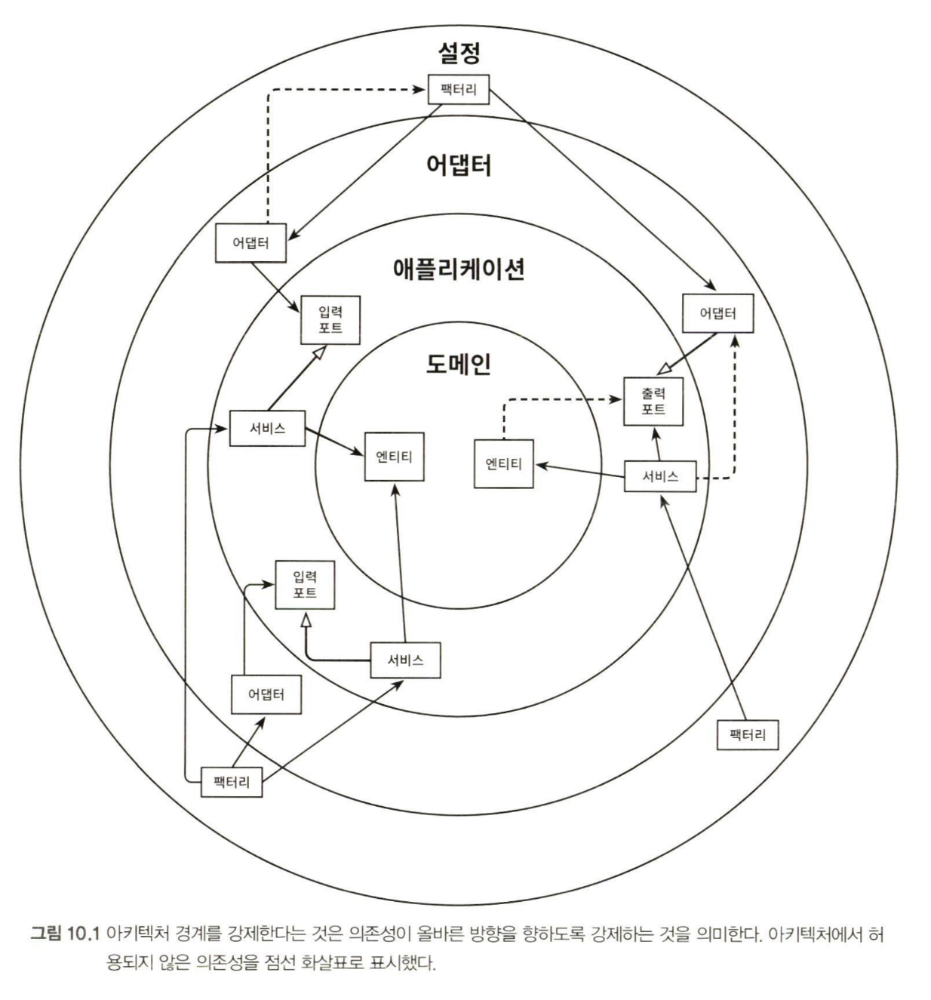
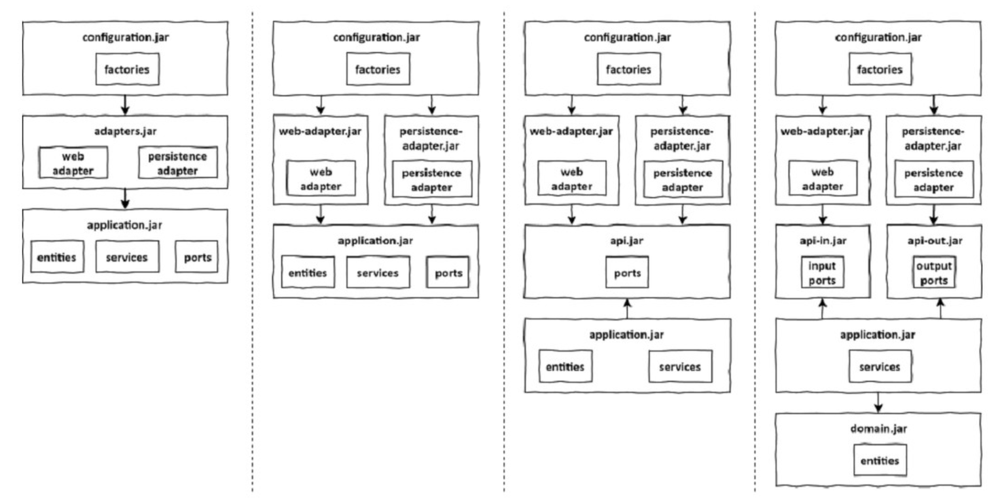

# 아키텍처 경계 강제하기

* 일정 규모 이상의 모든 프로젝트에서는 시간이 지나면서 아키텍처가 서서히 무너지게 된다.
* 계층 간의 경계가 약화되고, 코드는 점점 더 테스트하기 어려워지고, 새로운 기능을 구현하는 데 점점 더 많은 시간이 든다.

## 경계와 의존성



* 가장 안쪽의 계층에는 도메인 엔티티가 있다. 
* 애플리케이션 계층은 애플리케이션 서비스안에 유스케이스를 구현하기 위해 도메인 엔티티에 접근한다.
* 어댑터는 인커밍 포트를 통해 서비스에 접근하고, 반대로 서비스는 아웃고잉 포트를 통해 어댑터에 접근한다.
* 마지막으로 설정 계층은 어댑터와 서비스 객체를 생성할 팩터리를 포함하고 있고, 의존성 주입 메커니즘을 제공한다.
* 아키텍처의 경계는 꽤 명확하다. 각 계층 사이, 안쪽 인접 계층과 바깥쪽 인접 계층 사이에 경계가 있다.
* 의존성 규칙에 따르면 계층 경계를 넘는 의존성은 항상 안쪽 방향으로 향해야 한다.

## 접근 제한자

* `package-private` 제한자는 왜 그렇게 중요할까? 자바 패키지를 통해 클래스들을 응집적으로 '모듈'로 만들어 주기 때문이다.
* 이러한 모듈 내에 있는 클래스들은 서로 접근 가능하지만, 패키지 바깥에서는 접근할 수 없다. 그럼 모듈의 진입점으로 활용될 클래스들만 콜라서 `public`으로
 만들면 된다.
* 이렇게 하면 의존성이 잘못된 방향을 가리켜서 의존성 규칙을 위반할 위험이 줄어든다.
```bash
buckpal
|-- account
    |-- adapter
    |   |-- in
    |   |   |-- web
    |   |       |-- o AccountController
    |   |-- out
    |   |   |-- persistence
    |   |       |-- o AccountPersistenceAdapter
    |   |       |-- o SpringDataAccountRepository
    |-- domain
    |   |-- + Account
    |   |-- + Activity
    |-- application
        |--  o SendMoneyService
        |-- port
            |-- in
            |   |-- + SendMoneyUseCase
            |-- out
            |   |-- + LoadAccountPort
            |   |-- + UpdateAccountStatePort
```
* `persistence` 패키지에 있는 클래스들은 외부에서 접근할 필요가 없기 때문에 `package-private`(위 트리에 'o'으로 표시)으로 만들 수 있다.
* 같은 이유로 `SendMoneyService`를 `package-private`으로 만들 수 있다. 의존성 메커니즘은 일반적으로 리플렉션을 이용해 클래스를 인스턴스로 만들기 때문에 
`package-private`이더라도 여전히 인스턴스를 만들 수 있다.
* 나머지 클래스들은 아키텍처의 정의에 의해 `public`('+' 표시)이어야 한다.
* `package-private` 제한자는 몇 개 정도의 클래스로만 이뤄진 작은 모듈에서 가장 효과적이다. 그러나 패키지 내의 클래스가 특정 개수를 넘어가기
 시작하면 하나의 패키지에 너무 많은 클래스를 포함하는 것이 혼란스러워지게 된다.
* 이렇게 되면 코드를 쉽게 찾을 수 있도록 하위 패키지를 만드는 방법을 선호하게 된다. 하지만 자바는 하위 패키지를 다른 패키지로 취급하기 때문에
 하위 패키지의 `package-private` 멤버에 접근할 수 없게 된다.
* 그래서 하위 패키지의멤버는 `public`으로 만들어서 바깥 세계에 노출시켜야 하기 때문에 우리의 아키텍처에서 의존성 규칙이 깨질 수 있는 환경이 만들어진다.

## 컴파일 후 체크

* 클래스에 `public` 제한자를 쓰면 아키텍처 상의 의존성 방향이 잘못되더라도 컴파일러는 다른 클래스들이 이 클래스를 사용하도록 허용한다. 
* 이런 경우에는 컴파일러가 전혀 도움이 되지 않기 때문에 의존성 규칙을 위반했는지 확인할 다른 수단을 찾아야 한다.
* 한 가지 방법은 컴파일 후 체크(post-compile check)를 도입하는 것이다.
  * 코드가 컴파일된 후에 런타임에 체크한다는 뜻이다. 이러한 런타임 체크는 지속적인 통합 빌드 환경에 자동화된 테스트 과정에서 가장 잘 동작한다.
  * 이러한 체크를 도와주는 자바용 도구로 `ArchUnit`이 있다. 다른 무엇보다 `ArchUnit`은 의존성 방향이 기대한 대로 잘 설정돼 있는지 체크할 수 있는 API를
   제공한다.
  * 의존성 규칙을 발견하면 예외를 던진다. 이 도구는 `JUnit`과 같은 단위 테스트 프레임워크 기반에서 가장 잘 동작하며 의존성 규칙을 위반할 경우 테스트를 실패시킨다.

## 빌드 아티팩트

* 빌드 아티팩트는 빌드 프로세스의 결과물이다. 자바에서 가장 인기 있는 빌드 도구는 메이븐과 그레이들이다.
* 빌드 도구의 주요한 기능 중 하나는 의존성 해결이다. 어떤 코드베이스를 빌드 아티팩트로 변환하기 위해 빌드 도구가 가장 먼저 할 일은 코드베이스가 의존하고 있는
 모든 아티팩트가 사용 가능한지 확인하는 것이다.
* 만약 사용 불가능한 것이 있다면 아티팩트 리포지토리로부터 가져오려고 시도한다. 이마저도 실패한다면 코드를 컴파일도 하기 전에 에러와 함께 빌드가 실패한다.
* 이를 활용해서 모듈과 아키텍처의 계층 간의 의존성을 강제할 수 있다(따라서 경계를 강제하는 효과가 생긴다).
* 각 모듈 혹은 계층에 대해 전용 코드베이스와 빌드 아티팩트로 분리된 빌드 모듈(JAR 파일)을 만들 수 있다. 각 모듈의 빌드 스크립트에서는 아키텍처에서 허용하는
 의존성만 지정한다. 클래스들이 클래스패스에 존재하지도 않아 컴파일 에러가 발생하기 때문에 개발자들은 더이상 실수로 잘못된 의존성을 만들 수 없다.



* 빌드 모듈로 아키텍처 경계를 구분하는 것은 패키지로 구분하는 방시과 비교했을 때 몇 가지 장점이 있다.
1. 빌드 도구가 순환 의존성(circular dependency)을 극도로 싫어한다는 것이다. 순환 의존성은 하나의 모듈에서 일어나는 변경이 잠재적으로 순환 고리에 포함된
 다른 모든 모듈을 변경하게 만들며, 단일 책임 원칙을 위배하기 때문에 좋지 않다. 빌드 도구는 이러한 순환 의존성을 허용하지 않는다.
   * 자바 컴파일러는 순환 의존성에 대해 신경 쓰지 않는다.
2. 빌드 모듈 방식에서는 다른 모듈을 고려하지 않고 특정 모듈의 코드를 격리한 채로 변경할 수 있다. 
3. 모듈 간 의존성이 빌드 스크립트에 분명하게 선언돼 있기 때문에 새로 의존성을 추가하는 일은 우연이 아닌 의식적인 행동이 된다.

* 하지만 이런 장점에는 빌드 스크립트를 유지보수하는 비용을 수반하기 때문에 아키텍처를 여러 개의 빌드 모듈로 나누기 전에 아키텍처가 어느 정도는 
안정된 상태여야 한다.
