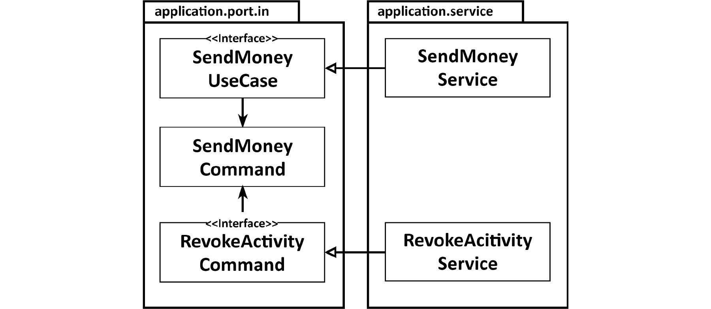
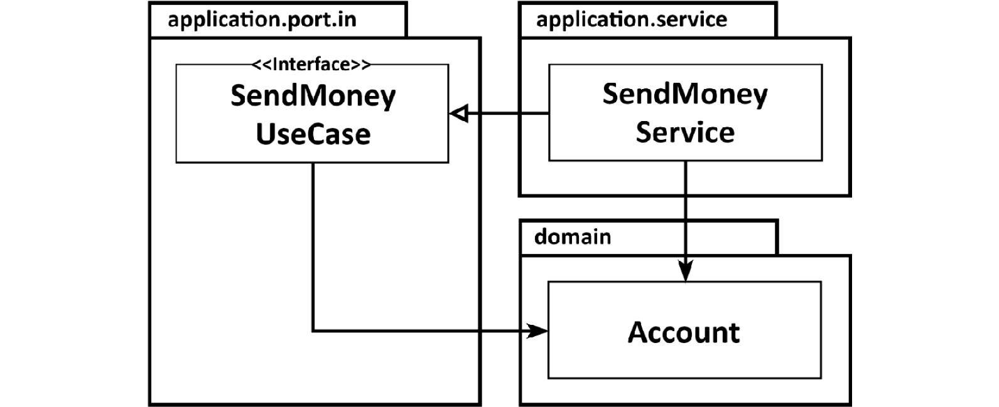
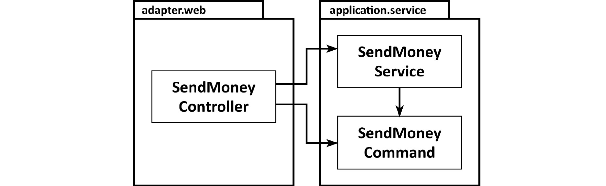
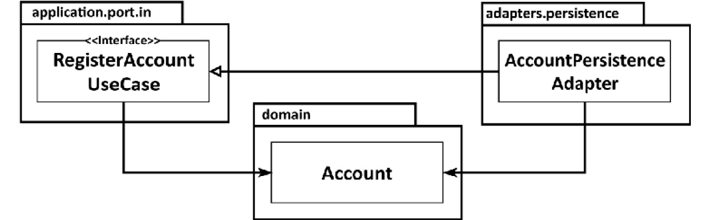

# 의식적으로 지름길 사용하기

## 왜 지름길은 깨진 창문 같을까?

* 품질이 떨어진 코드에서 작업할 때 더 낮은 품질의 코드를 추가하기가 쉽다.
* 코딩 규칙을 많이 어긴 코드에서 작업할 때 또 다른 규칙을 어기기도 쉽다.
* 지름길을 많이 사용한 코드에서 작업할 때 또 다른 지름길을 추가하기도 쉽다.

이 모든 것을 고려하면 이른바 '레거시'라고 불리는 많은 코드의 품질이 시간이 가면서 심하게 낮아졌다는 게 그리 놀라운 일은 아니다.

## 깨끗한 상태로 시작할 책임

* 우리는 모두 깨진 창문 심리에 무의식적으로 영향을 받는다. 그래서 가능한 한 지름길을 거의 쓰지 않고 기술 부채를 지지 않은 채로 프로젝트를 깨끗하게
 시작하는 것이 중요하다.
* 소프트웨어 프로젝트는 대개 큰 비용이 들고 장기적인 노력을 필요로 하기 때문에 깨진 창문을 막는 것이 소프트웨어 개발자들의 아주 막대한 책임이다.
* 그러나 때로는 지름길을 취하는 것이 더 실용적일 때도 있다. 이러한 의도적인 지름길에 대해서는 세심하게 잘 기록해둬야 한다. 
* 우리는 미래의 우리 혹은 프로젝트를 인계받는 이들에게 빚을 지고 있는 것이다. 만약 팀원 모두가 이 문서에 대해 인지하고 있다면 지름길이 합리적인 이유에 의해
 의도적으로 추가됐다는 사실을 알기 때문에 깨진 창문 이론의 영향을 더 줄일 수 있을 것이다.

## 유스케이스 간 모델 공유하기

* 유스케이스마다 다른 입출력 모델을 즉, 입력 파라미터의 타입과 반환값의 타입이 달라야 한다.

* 유스케이스 간에 입출력 모델을 공유하게 되면 유스케이스들 사이에 결합이 생긴다.
* 단일 책임 원칙에서 이야기하는 `변경할 이유`를 공유하는 것이다. 출력 모델을 공유하는 경우에도 마찬가지다.
* 유스케이스 간 입출력 모델을 공유하는 것은 유스케이스들이 기능적으로 묶여 있을 때 유효하다.
  * 즉, 특정 요구사항을 공유할 때 괜찮다는 의미다. 
  * 이 경우 **특정 세부사항을 변경할 경우 실제로 두 유스케이스 모두에 영향을 주고 싶은 것이다.**
* 두 유스케이스가 서로 간에 미치는 영향 없이 독립적으로 진화해야 한다면 입출력 모델을 공유하는 방식은 지름길이 된다.
* 만약 독립적으로 진화해야 한다면 처음에는 똑같은 입출력 클래스를 복사해야 하더라도 일단 분리해서 시작해야 한다.

## 도메인 엔티티를 입출력 모델로 사용하기

* 도메인 엔티티를 유스케이스의 입출력 모델로 사용하면 도메인 엔티티가 유스케이스에 결합된다.
* 이 지름길이 위험한 이유는 많은 유스케이스가 간단한 생성 또는 업데이트 유스케이스로 시작해서 시간이 지나면서 복잡한 도메인 로직 괴물이 되어간다는 사실 때문이다.
* 그러므로 처음에는 도메인 엔티티를 입력 모델로 사용했더라도 도메인 모델로부터 독립적인 전용 입력 모델로 교체해야 하는 시점을 잘 파악해야 한다.

## 인커밍 포트 건너뛰기

* 아웃고잉 포트는 애플리케이션 계층과 아웃고잉 어댑터 사이의 의존성을 역전시키기 위한(의존성이 안쪽을 향하게 하는) 필수 요소인 반면 인커밍 포트는 의존성
 역전에 필수 적인 요소는 아니다.

* 인커밍 포트가 없으면 도메인 로직의 진입점이 불분명해진다.
* 전용 인커밍 포트를 유지하면 한눈에 진입점을 식별할 수 있다. 이는 새로운 개발자가 코드를 파악할 때 특히 더 도움이 된다.

## 애플리케이션 서비스 건너뛰기

 

* 애플리케이션 서비스가 없으면 도메인 로직을 둘 곳이 없다.
* 간단한 CRUD 유스케이스에서는 보통 애플리케이션 서비스가 도메인 로직 없이 생성, 업데이트, 삭제 요청을 그대로 영속성 어댑터에 전달하기 때문에 
구미가 당기는 방법이다.
* 하지만 이 방법은 인커밍 어댑터와 아웃고잉 어댑터 사이에 모델을 공유해야 한다. 이 경우엔 공유해야 하는 모델이 `Account` 도메인 엔티티이므로 앞에서 이야기한 도메인
 모델을 입력 모델로 사용하는 케이스가 되는 것이다.
* 만약 시간이 지남에 따라 CRUD 유스케이스가 점점 복잡해지면 도메인 로직을 그대로 아웃고잉 어댑터에 추가하고 싶은 생각이 들것이다. 이렇게 되면 도메인
 로직이 흩어져서 도메인 로직을 찾거나 유지보수하기 어려워진다.
