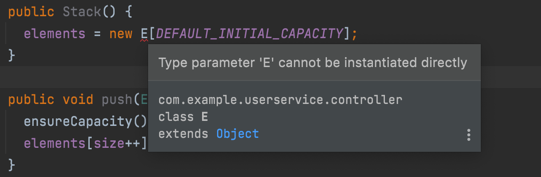
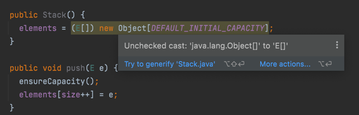
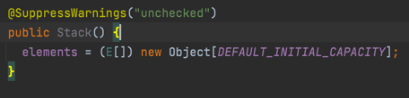
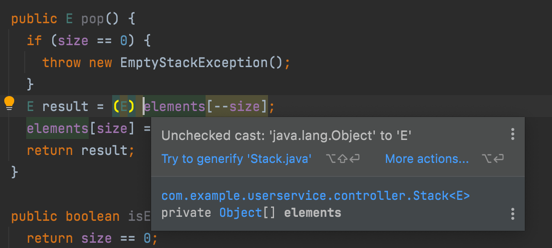
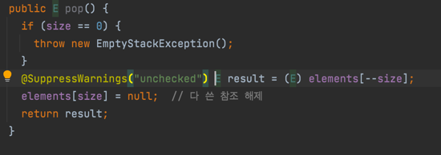

# 이왕이면 제네릭 타입으로 만들라

* `JDK`가 제공하는 제네릭 타입과 메서드를 사용하는 일은 일반적으로 쉬운편이지만 제네릭 타입을 새로 만드는 일은 조금 더 어렵다.

```java
public class Stack {
  private Object[] elements;
  private int size = 0;
  private static final int DEFAULT_INITIAL_CAPACITY = 16;
  
  public Stack() {
    elements = new Object[DEFAULT_INITIAL_CAPACITY];
  } 
  
  public void push(Object e) {
    ensureCapacity();
    elements[size++] = e;
  }
  
  public Object pop() {
    if (size == 0) {
      throw new EmptyStackException();
    }
    Object result = elements[--size];
    elements[size] = null;  // 다 쓴 참조 해제
    return result;
  }
  
  public boolean isEmpty() {
    return size == 0;
  }
  
  private void ensureCapacity() {
    if (elements.length == 0) {
      elements = Arrays.copyOf(elements, 2 * size + 1);
    }
  } 
}
```

* 위 스택 코드는 원래 제네릭 타입이어야 한다.
* 일반 클래스를 제네릭 클랙스로 만드는 첫 단계는 클래스 선언에 타입 매개 변수를 추가하는 일이다.

```java
public class Stack<E> {
  private E[] elements;
  private int size = 0;
  private static final int DEFAULT_INITIAL_CAPACITY = 16;

  public Stack() {
    elements = new E[DEFAULT_INITIAL_CAPACITY];  
  }

  public void push(E e) {
    ensureCapacity();
    elements[size++] = e;
  }

  public E pop() {
    if (size == 0) {
      throw new EmptyStackException();
    }
    E result = elements[--size];
    elements[size] = null;  // 다 쓴 참조 해제
    return result;
  }

  public boolean isEmpty() {
    return size == 0;
  }

  private void ensureCapacity() {
    if (elements.length == 0) {
      elements = Arrays.copyOf(elements, 2 * size + 1);
    }
  }
} 
```

* 위 코드는 아래와 같은 오류가 발생한다.


* [아이템 28](https://github.com/parkhanbeen/study/blob/master/effective-java/5%EC%9E%A5/28.%EB%B0%B0%EC%97%B4%EB%B3%B4%EB%8B%A4%EB%8A%94%20%EB%A6%AC%EC%8A%A4%ED%8A%B8%EB%A5%BC%20%EC%82%AC%EC%9A%A9%ED%95%98%EB%9D%BC.md) 에서 설명한것 처럼, `E`와 같은 실체화 불가 타입으로는 배열을 만들 수 없다. 
* 적절한 해결책 두가지가 있다.


### 첫번째 방법

* 제네릭 배열 생성을 금지하는 제약을 대놓고 우회하는 방법이다.
* `Object` 배열을 생성한 다음 제네릭 배열로 형변환해보자. 이제 컴파일러는 오류 대신 경고를 내보낼 것이다.

* 이렇게도 할 수 있지만 타입 안전을 보장하진 않는다.
* 컴파일러는 타입 안전한지 증명할 방법이 없지만 우리는 비검사 형변환이 프로그램의 타입 안전성을 해치지 않음을 확인해야 한다.
* `elements`는 `private` 필드에 저장되고, 클라이언트로 반환되거나 다른 메서드에 전달되는 일이 전혀 없다.
* `push` 메서드를 통해 배열에 저장되는 원소의 타입은 항상 `E`다. 따라서 이 비검사 형변환은 확실히 안전하다.
* 비검사 형변환이 안전함을 증명했다면 최소로 범위를 좁혀 `@SupperssWarnings` 어노테이션으로 해당 경고를 숨긴다. [(item 27)](https://github.com/parkhanbeen/study/blob/master/effective-java/5%EC%9E%A5/27.%EB%B9%84%EA%B2%80%EC%82%AC%20%EA%B2%BD%EA%B3%A0%EB%A5%BC%20%EC%A0%9C%EA%B1%B0%ED%95%98%EB%9D%BC.md)



### 두번째 방법

* `elements` 필드 타입을 `E[]`에서 `Object[]`로 바꾸는 것이다.


* `E`는 실체화 불가 타입으로 컴파일러는 런타임에 이뤄지는 형변환이 안전한지 증명할 방법이 없다.

* `@SupperssWarnings` 어노테이션을 비검사 형변환을 수행하는 할당문에만 선언하여 해당 경고를 숨길수 있다.

### 첫 번째 방법을 선호하는 이유

* 첫번째 방법의 장단점
  * 가독성이 좋다.
  * 배열의 타입을 `E[]`로 선언하여 오직 `E`타입 인스턴스만 받음을 확실히 보여준다.
  * 코드도 더 짧다. 보통의 제네릭 클래스라면 코드 이곳저곳에서 배열을 자주 사용하게 되는데 첫 번째 방식에서는 형변환을
    배열 생성시 단 한번만 해주면 되지만, 두 번째 방식은 배열에서 원소를 읽을 때마다 해줘야 한다.
  * 따라서, 현업에서는 첫 번째 방식을 더 선호하며 자주 사용한다.
  * 하지만 (`E`가 `Object`가 아닌 한) 배열의 런타임 타입이 컴파일타임 타입과 달라 힙 오염(heap pollution; [아이템 32](https://github.com/parkhanbeen/study/blob/master/effective-java/5%EC%9E%A5/32.%EC%A0%9C%EB%84%A4%EB%A6%AD%EA%B3%BC%20%EA%B0%80%EB%B3%80%EC%9D%B8%EC%88%98%EB%A5%BC%20%ED%95%A8%EA%BB%98%20%EC%93%B8%20%EB%95%8C%EB%8A%94%20%EC%8B%A0%EC%A4%91%ED%95%98%EB%9D%BC.md)) 을 일으킨다.
  * 힙 오염이 맘에 걸리는 프로그래머는 두 번째 방식을 고수하기도 한다.

## 정리

* 클라이언트에서 직접 형변환해야 하는 타입보다 제네릭 타입이 더 안전하고 쓰기 편하다.
* 그러니 새로운 타입을 설계할 때는 형변환 없이도 사용할 수 있도록 하라.
* 그렇게 하려면 제네릭 타입으로 만들어야 할 경우가 많다. 
* 기존 타입 중 제네릭이었어야 하는 게 있다면 제네릭 타입으로 변경하자.
* 기존 클라이언트에는 아무 영향을 주지 않으면서, 새로운 사용자를 휠씬 편하게 해주는 길이다.[(item 26)](https://github.com/parkhanbeen/study/blob/master/effective-java/5%EC%9E%A5/26.%EB%A1%9C%20%ED%83%80%EC%9E%85%EC%9D%80%20%EC%82%AC%EC%9A%A9%ED%95%98%EC%A7%80%20%EB%A7%90%EB%9D%BC.md)
