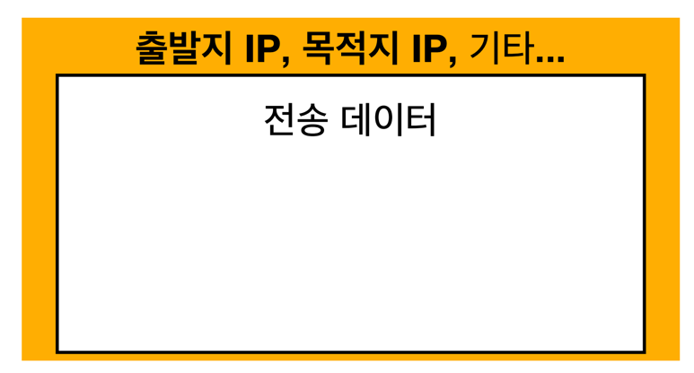

# 인터넷 네트워크

## 인터넷이란?
* 인터넷(Internet)이란 여러 통신망을 하나로 연결한다는 의미의 ‘인터 네트워크(inter-network)’라는 말에서 시작되었으며, 
이제는 전 세계 컴퓨터들을 하나로 연결하는 거대한 컴퓨터 통신망을 의미
* 인터넷은 클라이언트와 서버로 구성되며, TCP/IP 라는 기본 프로토콜을 통해 제공

## 컴퓨터는 어떤 방식으로 통신할까?
* 클라이언트와 서버 사이에 인터넷이라는 망이 존재한다. 만약에 나는 한국에 있고 내 친구는 유럽에 있다고 가정하자.
나는 친구에게 메세지를 전송하는데 그 가운데 수많은 노드들을 거치면서 친구가 있는 유럽에 내가 보낸 메세지가 안전하게 도착해야한다.
* 복잡한 인터넷 망을 거쳐 멀리에있는 곳에 메세지를 안전하게 보내기 위해서는 최소한의 규칙이 있어야한다.

## IP(Internet Protocol)란 무엇인가?
* 인터넷에 연결되어 있는 모든 장치들(컴퓨터, 서버 장비, 스마트폰 등)을
식별할 수 있도록 각각의 장비에게 부여되는 고유 주소이다.

### IP의 역할은?
* 지정한 IP 주소에 데이터 전달
* 패킷(Packet)이라는 통신 단위로 데이터 전달

### 패킷(Packet)이란?

* 
* 패킷은 컴퓨터 네트워크에서 데이터를 주고 받을 때 정해놓은 규칙이다.
* 패킷은 전송 데이터(내가 유럽 친구에게 보낼 메세지) 위에 출발지 IP, 목적지 IP를 주소 적듯이 적어준다.
* 인터넷 망에 패킷을 던지면 각각의 노드들이 출발지와 목적지를 인식하여 해당 목적지 서버까지 도착할 수 있도록 패킷을 전달한다.

### IP 프로토콜의 한계
* 비연결성 
  * 클라이언트가 서버가 있든 없든 서비스가 불능이든 상관없이 패킷을 전송
* 비신뢰성
  * 패킷을 보냈을때 중간 노드에 문제가 생겨 패킷이 사라지는 경우 등등 패킷이 정확하게 잘도착했는지 상태 확인 불가
  * 패킷의 크기에 따라 다른 노드로 보내질 수 있기 때문에 순서 보장이 안됨
* 프로그램 구분
  * 같은 IP내에 여러 애플리케이션을 사용할 경우 구분하기 어려움

### TCP UDP
* 앞서 ```IP 프로토콜의 한계```를 ```TCP```에서 해결할 수 있다.


## 프로토콜 계층


* ```Hello, world!```라는 메세지를 보낼때 ```socket 라이브러리``` 를 통해 os 계층에 메세지를 넘긴다.
* os 계층에서 TCP 정보를 생성한 후 그 위에 IP 패킷을 생성한다.(IP패킷 안에 -> TCP관련 정보 안에 -> 내가 만든 메세지 정보)
* 네트워크 인터페이스 계층의 ```LAN카드```를 통해서 전달될때 ```이더넷 프레임(Ethernet frame)```을 통해 전송된다.

### 이더넷 프레임(Ethernet frame)이란?
* osi 2계층인 데이터 링크 계층에서 사용되는 전송 메카니즘으로 프레임은 데이터를 담는 컨테이너라고 보면 된다.

## TCP/IP 패킷 정보


* IP 패킷 안에 TCP/IP 정보가 들어간다.
* ```출발지 PORT```, ```목적지 PORT```, ```전송 제어```, ```순서 정보```, ```검증 정보``` 등등이 들어있다.
* 해당 정보로 인해 IP 패킷으로 해결안되었던 문제들이 해결된다.

## TCP : 전송 제어 프로토콜(Transmission Control Protocol) 특징이란?
* 연결지향 - TCP 3 way handshake (가상 연결)


```
TCP/IP프로토콜을 이용해서 통신을 하는 응용프로그램이 데이터를 전송하기 전에 먼저 정확한 전송을 보장하기 위해 상대방 컴퓨터와 사전에 세션을 수립하는 과정

1. 클라이언트가 서버에게 SYN(접속 요청)을 보낸다.
2. 서버가 연결 가능 상태일 경우 클라이언트의 접속 요청에 대한 응답으로 ACK(요청 수락)과 함께 서버의 SYN(접속 요청)을 함께 보낸다.
3. 클라이언트는 서버의 SYN(접속 요청)에 대한 응답 ACK(요청 수락)과 함께 데이터 전송이 가능하다.
```


* 데이터 전달 보증
  * 클라이언트에서 데이터를 전송했을때 서버에서 데이터를 잘 받았을 경우 잘 받았다는 메세지를 보내준다.

* 순서 보장
  * 클라이언트에서 패킷1, 패킷2, 패킷3, 패킷4, 패킷5, 패킷6으로 보냈는데 서버에 패킷1, 패킷3, 패킷2, 패킷4, 패킷5, 패킷6 순서로 도착
    했을 경우 서버에선 패킷1 이후 패킷을 다 버리고 클라이언트에 패킷2부터 다시보내라는 요청을 한다.

## UDP : 사용자 데이터그램 프로토콜(User Datagram Protocol) 특징이란?
* 비연결형 서비스이다.
* 패킷 교환 방식이 데이터그램 방식이다.
* 전송 순서가 보장되지 않는다.
* 신뢰성이 낮고 전송 속도가 빠르다.
* TCP와는 다르게 기능이 거의 없다. 하지만 단순하고 빠르다.
* IP와 거의 같다.(IP에 port, 체크섬 정도 추가됨)

### UDP의 장점?
* TCP는 이미 다쓰고 있기 때문에 손대기 힘들다. 하지만 사용자가 무언가를 추가하거나 최적화하기 위해서는 TCP말고 UDP를 쓰면 된다.
* HTTP/ 3.0 부터는 UDP를 사용한다.

## PORT란?
* OSI 7 Layer의 Transport 계층에서 동작하는 TCP / UDP 프로토콜에서 애플리케이션이 상호구분을 위해 사용하는 번호
* 하나의 IP 서버에서 둘 이상의 애플리케이션을 연결 해야할 때 PORT 번호로 구분한다.
IP가 목적지 서버를 찾기 위함이라면, PORT는 서버 안에서 돌아가는 애플리케이션을 구분하기 위함이다.

```
• 0 ~ 65535 할당 가능
• 0 ~ 1023: 잘 알려진 포트, 사용하지 않는 것이 좋음
  • FTP - 20, 21
  • TELNET - 23
  • HTTP - 80
  • HTTPS - 443
```

## DNS: 도메인 네임 시스템(Domain Name System)란?
* IP는 기억하기 어렵고 변경될 수 있다. 처음에 서버의 IP가 ```100.172.200.33``` 였으나 나중에 ```100.172.200.34```
  변경될 경우 클라이언트는 과거의 IP만 알고 있다면 서버에 접근할 수 없게 된다.
* 위와 같은 경우을 방지하기 위해 DNS 서버에 도메인 명과 IP를 등록하여 사용할 수 있다.