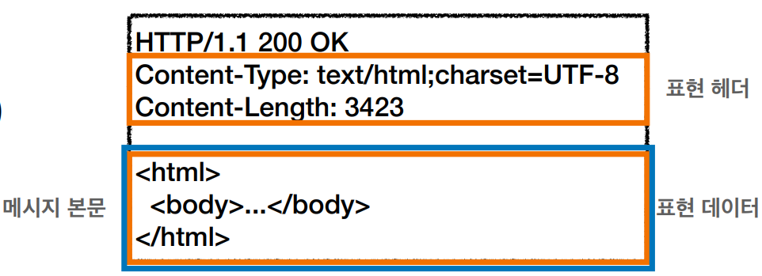

# HTTP 헤더

## HTTP 헤더란?

* ```HTTP 헤더```는 클라이언트와 서버가 요청 또는 응답으로 부가적인 정보를 전송을 할 수 있게 한다.
* ```HTTP 헤더```는 대소문자를 구분하지 않는 이름과 콜론 ':' 다음에 오는 값(줄 바꿈 없이)으로 이루어져 있다. 
  값 앞에 붙은 빈 문자열은 무시된다.

### HTTP 헤더 용도

* HTTP 전송에 필요한 모든 부가정보
* 예) 메시지 바디의 내용, 메시지 바디의 크기, 압축, 인증, 요청 클라이언트, 서버 정보, 캐
  시 관리 정보...
* 표준 헤더가 너무 많음
  * ```https://en.wikipedia.org/wiki/List_of_HTTP_header_fields```
* 필요시 임의의 헤더 추가 가능
  * ```helloworld: hihi```

### HTTP 헤더의 분류 - 1999년 RFC2616(과거) - 폐기됨

* ```General 헤더``` : 메세지 전체에 적용되는 정보, 예) Connection : close
* ```Request 헤더``` : 요청 정보, 예) User-Agent : Mozilla/5.0 (Macintosh;..)
* ```Response 헤더``` : 응답정보, 예) Server : Apache
* ```Entity 헤더``` : 엔티티 바디 정보, 예) Content-Type : text/html, Content-Length : 3423
  * **엔티티 헤더**는 **엔티티 본문**의 데이터를 해석할 수 있는 정보 제공
    * 데이터 유형(``html``, ``json``), 데이터 길이, 압축 정보 등등

### HTTP 헤더의 분류 - 2014년 RFC7230~7235 등장



* 엔티티(Entity) -> 표현(Representation)
* Representation = representation Metadata + Representation Data
* 표현 = 표현 메타데이터 + 표현 데이터
* 메시지 본문(message body)을 통해 표현 데이터 전달
* 메시지 본문 = 페이로드(payload)
* 표현은 요청이나 응답에서 전달할 실제 데이터
* 표현 헤더는 표현 데이터를 해석할 수 있는 정보 제공
  * 데이터 유형(html, json), 데이터 길이, 압축 정보 등등
* 참고: 표현 헤더는 표현 메타데이터와, 페이로드 메시지를 구분해야 하지만, 여기서는 생략

## 표현

* Content-Type: 표현 데이터의 형식
  * 미디어 타입, 문자 인코딩
  * ```text/html; charset=utf-8```
  * ```application/json``` 기본이 utf-8임
  * ```image/png```
* Content-Encoding: 표현 데이터의 압축 방식
  * 표현 데이터를 압축하기 위해 사용
  * 데이터를 전달하는 곳에서 압축 후 인코딩 헤더 추가
  * 데이터를 읽는 쪽에서 인코딩 헤더의 정보로 압축 해제
  * ```gzip```
  * ```deflate```
  * ```identity```
* Content-Language: 표현 데이터의 자연 언어
  * ```ko```
  * ```en```
  * ```en-US```
* Content-Length: 표현 데이터의 길이
  * 바이트 단위
  * Transfer-Encoding(전송 코딩)을 사용하면 Content-Length를 사용하면 안됨
* 표현 헤더는 전송, 응답 둘다 사용

## 협상(콘텐츠 네고시에이션) - 클라이언트가 선호하는 표현 요청

* ```Accept```: 클라이언트가 선호하는 미디어 타입 전달
* ```Accept-Charset```: 클라이언트가 선호하는 문자 인코딩
* ```Accept-Encoding```: 클라이언트가 선호하는 압축 인코딩
* ```Accept-Language```: 클라이언트가 선호하는 자연 언어
* 협상 헤더는 요청시에만 사용

### 협상과 우선순위

* 
* Quality Values(q) 값 사용
* 0~1, **클수록 높은 우선순위**
* 생략하면 1
* ```Accept-Language: ko-KR,ko;q=0.9,en-US;q=0.8,en;q=0.7```
  1. ```ko-KR;q=1``` (q생략)
  2. ```ko;q=0.9```
  3. ```en-US;q=0.8```
  4. ```en:q=0.7```
* 구체적인 것이 우선한다.
* ```Accept: text/*, text/plain, text/plain;format=flowed, */*```
  1. ```text/plain;format=flowed```
  2. ```text/plain```
  3. ```text/*```
  4. ```*/*```
* 구체적인 것을 기준으로 미디어 타입을 맞춘다.
* ```Accept: text/*;q=0.3, text/html;q=0.7, text/html;level=1,text/html;level=2;q=0.4, */*;q=0.5```
  * 

## 전송 방식

* 단순 전송 - 한번에 요청하고 한번에 받는 것
* 압축 전송 - 서버에서 ```gzip```같은 걸로 압축해서 전송 ```Content-Encoding: gzip```같이 뭘로 압축했는지 추가로 넣어줘야함.
* 분할 전송 - 서버에서 ```Transfer-Encoding: chunked``` 추가해줘서 분할로 쪼개서 보낸다고 명시해줘야함
  * 
  * 용량이 큰데이터를 한번에 보내면 오래걸리지만 분할해서 보내면 받는 즉시 화면에 표현할 수 있다.
  * 분할 전송 방식은 ```Content-Length```를 넣으면 안된다. 왜냐하면 ```Content-Length```를 예상할 수 없고 각 분할 된 chunked들 마다 바이트가 있다.
* 범위 전송 - 컨텐츠의 범위를 지정해서 받을 수 있다.
  * 클라이언트 ```Range: bytes=1001-2000```로 요청 -> 서버에서 ```Content-Range: bytes 1001-2000 / 2000``` 요청 범위에 맞게 내려준다.

## 일반 정보

* From: 유저 에이전트의 이메일 정보
  * 일반적으로 잘 사용되지 않음
  * 검색 엔진 같은 곳에서, 주로 사용
  * 요청에서 사용
* Referer: 이전 웹 페이지 주소
  * 현재 요청된 페이지의 이전 웹 페이지 주소
  * A -> B로 이동하는 경우 B를 요청할 때 Referer: A 를 포함해서 요청
  * ```Referer```를 사용해서 유입 경로 분석 가능
  * 요청에서 사용
  * 참고: ```referer```는 단어 ```referrer```의 오타
* User-Agent: 유저 에이전트 애플리케이션 정보
  * user-agent: Mozilla/5.0 (Macintosh; Intel Mac OS X 10_15_7) AppleWebKit/
    537.36 (KHTML, like Gecko) Chrome/86.0.4240.183 Safari/537.36
  * 클리이언트의 애플리케이션 정보(웹 브라우저 정보, 등등)
  * 통계 정보
  * 어떤 종류의 브라우저에서 장애가 발생하는지 파악 가능
  * 요청에서 사용
* Server: 요청을 처리하는 오리진 서버의 소프트웨어 정보
  * Server: Apache/2.2.22 (Debian)
  * server: nginx
  * 응답에서 사용
* Date: 메시지가 생성된 날짜
  * ```Date: Tue, 15 Nov 1994 08:12:31 GMT```
  * 응답에서 사용

## 특별한 정보

* Host : 요청한 호스트 정보(도메인)
  * 요청에서 사용
  * **필수**
  * 하나의 서버가 여러 도메인을 처리해야 할 때
  * 하나의 IP 주소에 여러 도메인이 적용되어 있을 때
* Location : 페이지 리다이렉션
  * 웹 브라우저는 3xx 응답의 결과에 Location 헤더가 있으면, Location 위치로 자동 이동
    (리다이렉트)
  * 응답코드 3xx에서 설명
  * 201 (Created): Location 값은 요청에 의해 생성된 리소스 URI
  * 3xx (Redirection): Location 값은 요청을 자동으로 리디렉션하기 위한 대상 리소스를
    가리킴
* Allow : 허용 가능한 HTTP 메서드
  * 405 (Method Not Allowed) 에서 응답에 포함해야함
  * Allow: ```GET```, ```HEAD```, ```PUT```
  * 해당 ```URL```은 있지만 ```method```가 없는 경우 클라이언트가 ```GET```, ```HEAD```, ```PUT```만 지원하는 구나 하고 인식할 수 있음
  * 서버에서 많이 구현되어 있지 않음
* Retry-After : 유저 에이전트가 다음 요청을 하기까지 기다려야 하는 시간
  * 503 (Service Unavailable): 서비스가 언제까지 불능인지 알려줄 수 있음
  * Retry-After: ```Fri, 31 Dec 1999 23:59:59 GMT (날짜 표기)```
  * Retry-After: ```120 (초단위 표기)```

## 인증

* Authorization: 클라이언트 인증 정보를 서버에 전달
  * Authorization: ```Basic xxxxxxxxxxxxxxxx```
  * 인증과 관련된 여러가지 매커니즘에 따라 내용이 달라진다.
* WWW-Authenticate: 리소스 접근시 필요한 인증 방법 정의
  * 401 Unauthorized 응답과 함께 사용
  * WWW-Authenticate: Newauth realm="apps", type=1,
    title="Login to \"apps\"", Basic realm="simple"

## 쿠키

* Set-Cookie: 서버에서 클라이언트로 쿠키 전달(응답)
* Cookie: 클라이언트가 서버에서 받은 쿠키를 저장하고, ```HTTP``` 요청시 서버로 전달
* 모든 요청에 정보를 넘기는 문제 대안으로 쿠키를 사용

* 
* 
* 

* 예) set-cookie: sessionId=abcde1234; expires=Sat, 26-Dec-2020 00:00:00 GMT; path=/; domain=.google.com; Secure
* 사용처
  * 사용자 로그인 세션 관리
  * 광고 정보 트래킹
* 쿠키 정보는 항상 서버에 전송됨
  * 네트워크 트래픽 추가 유발
  * 최소한의 정보만 사용(세션 id, 인증 토큰)
  * 서버에 전송하지 않고, 웹 브라우저 내부에 데이터를 저장하고 싶으면 웹 스토리지 (localStorage, sessionStorage) 참고
* **주의!**
  * 보안에 민감한 데이터는 저장하면 안됨(주민번호, 신용카드 번호 등등)

### 쿠키 생명주기

* ```Set-Cookie``` : ```expires=Sat, 26-Dec-2020 04:39:21 GMT```
  * 만료일이 되면 쿠키 삭제
* ```Set-Cookie``` : ```max-age=3600 (3600초)```
  * 0이나 음수를 지정하면 쿠키 삭제
* 세션 쿠키: 만료 날짜를 생략하면 브라우저 종료시 까지만 유지
* 영속 쿠키: 만료 날짜를 입력하면 해당 날짜까지 유지

### 쿠키 - 도메인

* 예) ```domain=example.org```
* **명시: 명시한 문서 기준 도메인 + 서브 도메인 포함**
  * ```domain=example.org```를 지정해서 쿠키 생성
    * ```example.org```는 물론이고
    * ```dev.example.org```도 쿠키 접근
* **생략: 현재 문서 기준 도메인만 적용**
  * ```example.org``` 에서 쿠키를 생성하고 domain 지정을 생략
    * ```example.org``` 에서만 쿠키 접근
    * ```dev.example.org```는 쿠키 미접근

### 쿠키 - 경로

* 예) ```path=/home```
* 이 경로를 포함한 하위 경로 페이지만 쿠키 접근
* 일반적으로 ```path=/``` 루트로 지정
* 예)
  * ```path=/home``` 지정
  * ```/home``` -> 가능
  * ```/home/level1``` -> 가능
  * ```/home/level1/level2``` -> 가능
  * ```/hello``` -> 불가능

### 쿠키 - 보안

* Secure
  * 쿠키는 ```http, https```를 구분하지 않고 전송
  * ```Secure```를 적용하면 ```https```인 경우에만 전송
* HttpOnly
  * ```XSS``` 공격 방지
  * 자바스크립트에서 접근 불가(document.cookie)
  * ```HTTP``` 전송에만 사용
* SameSite
  * ```XSRF(CSRF)``` 공격 방지
  * 요청 도메인과 쿠키에 설정된 도메인이 같은 경우만 쿠키 전송

#### XSS란?

* XSS(Cross Site Script)란 웹 어플리케이션에서 사용자 입력 값에 대한 필터링이 제대로 이루어지지 않을 경우, 
  공격자가 입력이 가능한 폼에 악의적인 스크립트를 삽입하여 
  해당 스크립트가 희생자 측에서 동작하도록 하여 악의적인 행위를 수행하는 취약점이다. 
  공격자는 취약점을 이용하여 사용자의 개인정보 및 쿠키정보 탈취, 
  악성코드 감염, 웹 페이지 변조 등의 공격을 수행한다.

##### XSS 공격 종류

* Stored XSS (저장형 XSS)
  * 공격자가 취약한 웹서버에 악성 스크립트를 저장하면 희생자가 해당 자료를 요청할 떄 
    해당 악성 스크립트가 삽입된 응답 페이지가 전달되어 클라이언트 측에서 동작하는 방식이다.
* Reflected XSS (반사형 XSS)
  * 외부에 있는 악성 스크립트가 희생자 액션에 의해 취약한 웹서버로 전달되고, 
    웹서버의 응답 페이지에 해당 악성 스크립트가 삽입되어 희생자 측에서 동작하는 방식이다.
* DOM based XSS (DOM 기반 XSS)
  * 희생자의 웹 브라우저에서 응답 페이지에 포함된 정상적인 스크립트가 동작하면서 
    ```DOM``` 객체를 실행할 때 ```URL``` 등에 포함된 악성 스크립트가 동작하는 방식이다. 
    응답 페이지에 관계없이 웹 브라우저에서 발생한다.

##### 대응 방법

* 사용자 입력값 검증을 반드시 **서버단**에서 한다.
* 사용자 입력 문자열에서 ```HTML``` 코드로 인식될 수 있는 **특수문자를 일반 문자로 치환**하여 처리한다.
* 게시판 등에서 ```HTML``` 태그를 허용해야하는 경우, ```HTML``` 태그 **화이트리스트**를 선정 후, 
  해당 태그만 허용하는 방식을 적용한다.

#### CSRF(Cross Stie Request Forgery) 란?

* 사이트간 요청 위조 : 웹 애플리케이션 취약점 중 하나로 사용자가 자신의 의지와 무관하게 공격자가 의도한 행동을 하여 
   특정 웹페이지를 보안에 취약하게 한다거나 수정, 삭제 등의 작업을 하게 만드는 공격방법을 의미한다 - ```나무위키```

#### CSRF 원리

* 공격자는 희생자의 개인 정보등을 얻거나 권한을 얻기 위해 취약한 웹사이트에 ```HTTP```로 작성된 요청문을 게시판에
  등록한다. (ex, 희생자 정보 요청 또는 비밀번호 변경 등등..)
* 공격자의 게시물이 ```DB```에 저장되고, 게시글이 등록된다.
* 희생자는 공격자가 올려놓은 게시글을 읽게 되고 링크 또는 이미지에 삽입된 링크를 클릭하면서 **공격자가 작성한 HTTP
  를 자신의 권한으로 실행, 웹서버에 요청**을 한다.
* 희생자의 권한으로 ```HTTP```요청을 받은 웹서버는 요청을 처리하고 응답을 보낸다. 공격자의 의도대로 실행이 되었고
  희생자는 의도하지 않은 피해를 입게 된다.

#### 대응 방법

* 중요한 요청에 대한 재인증 요청
* 사용자의 접근 권한 정보가 포함된 토큰을 생성하고 사용자가 웹 서버에 요청을 보낼 때 토큰 값으로 검증
