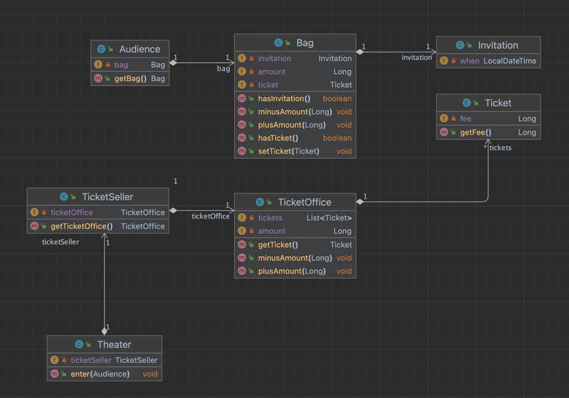

# 객체 & 설계

## 최초 설계



## 문제점

* 소프트웨어 모듈에는 세가지 목적이 있다.
  1. 실행 중에 제대로 동작해야 한다.
  2. 변경을 위해 존재해야 한다.
     * 간단한 작업만으로도 변경 가능해야 하고 변경하기 어려운 모듈은 제대로 동작하더라도 개선해야한다.
  3. 코드를 읽는 사람과 의사소통해야 한다.
     * 쉽게 읽고 이해할 수 있어야 한다.
     
* 하지만 최초 설계는 변경 용이성과 읽는 사람과의 의사소통이라는 목적을 만족시키지 못한다.

```java
/**
 * 소극장.
 */
public class Theater {
    private TicketSeller ticketSeller;

    public Theater(TicketSeller ticketSeller) {
        this.ticketSeller = ticketSeller;
    }

    public void enter(Audience audience) {
        if (audience.getBag().hasInvitation()) {
            Ticket ticket = ticketSeller.getTicketOffice().getTicket();
            audience.getBag().setTicket(ticket);
        } else {
            Ticket ticket = ticketSeller.getTicketOffice().getTicket();
            audience.getBag().minusAmount(ticket.getFee());
            ticketSeller.getTicketOffice().plusAmount(ticket.getFee());
            audience.getBag().setTicket(ticket);
        }
    }
}

```

### 문제점 1. 예상을 빗나가는 코드

* 관람객과 판매원 모두 소극장의 통제를 받는 수동적인 존재이다.
  * 현실에선 관람객이 직접 가방에서 초대장을 꺼내고, 판매원에게 건넨다.
* 코드를 이해하기 어려운 또다른 이유가 있다.
  * 코드를 이해하기 위해서 세부적인 내용들을 한꺼번에 기억하고 있어야 한다는 점이다.
  * `Audience`가 `Bag`을 가지고 `Bag`안에 현금과 티켓이 있으며 `TicketSeller`rk `TicketOffice`에서 티켓을 판매하고,
   `TicketOffice`안에 돈과 티켓이 보관돼 있다는 사실을 기억하고 있어야 한다.
  * 하나의 클래스나 메서드에서 너무 많은 세부사항을 다루기 때문에 코드를 읽고 이해해야 하는 사람 모두에게 큰 부담을 준다.

### 문제점 2. 변경에 취약한 코드

* 해당 코드는 관람객이 현금과 초대장을 보관하기 위해 항상 가방을 들고 다닌다고 가정하지만 관람객이 가방을 들고 있지 않을 경우는 어떻게 해야
 할까? 이럴 경우 모든 코드가 흔들리게 된다.
* 이것은 객체 사이의 **의존성(dependency)** 과 관련된 문제다.


## 설계 개선

* 변경에 용의하고 이해하기 쉬운 코드로 만들기 위한 방법은 간단하다.
* 소극장(`Theater`)이 관람객(`Audience`)과 판매원(`TicketSeller`)에 너무 세세한 부분을 알지 못하도록 차단하면 된다.


